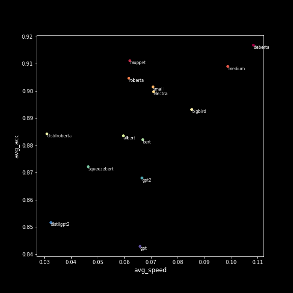

# Text Classification Benchmark
What is the best transformer model for text classification? We compare a number of models in terms of inference speed accuracy tradeoff on a set of 15 text classification datasets.

We retrain multiple models on multiple datasets using a standard training process. We do not aim to get optimal performance out of models through extensive hyperparameter tuning, we aim to show performance that can be realistically expected in practice. We compare relatively small bert-base sized models that are fine tuned on moderately sized datasets, not LLMs using prompt engineering.

We also show the results for each dataset individually:

## Limitations

* This is part of an abandoned research project, so take the results with a grain of salt.
* Compares inference using raw Pytorch models, in practice we would be optimizing this (e.g. using deepspeed) when doing deployment, and comparisons between models may not hold.
* Inference speeds are average over a set of sequence lengths, not specific to a dataset.